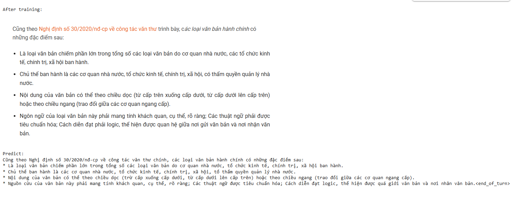

# Fine-tuning Gemma 3 4B for Vietnamese OCR

This project demonstrates fine-tuning the Unsloth Gemma 3 4B model for Optical Character Recognition (OCR) tasks on Vietnamese text. The project utilizes the `unsloth` library for efficient fine-tuning of large language models and vision models.

## Project Overview

The goal of this project is to adapt a pre-trained Gemma 3 4B model to accurately extract Vietnamese text from images, specifically focusing on scanned documents or images containing text.

##Demo

## Dataset

The project uses the `ademax/ocr_scan_vi_01` dataset from Hugging Face for training. This dataset contains images paired with their corresponding Vietnamese text.

- **Dataset Name:** `ademax/ocr_scan_vi_01`
- **Description:** Images containing Vietnamese text and their transcriptions, suitable for OCR tasks.

## Model

The project fine-tunes the `unsloth/gemma-3-4b-pt-unsloth-bnb-4bit` model. This is a pre-trained vision-language model optimized for efficient fine-tuning with Unsloth.

- **Base Model:** `unsloth/gemma-3-4b-pt-unsloth-bnb-4bit`
- **Fine-tuning Method:** LoRA (Low-Rank Adaptation)

## Setup and Installation

The project relies on the `unsloth` library and other dependencies. The provided notebook includes steps to install the necessary packages.

## Reference
Link: https://docs.unsloth.ai/get-started/fine-tuning-llms-guide
